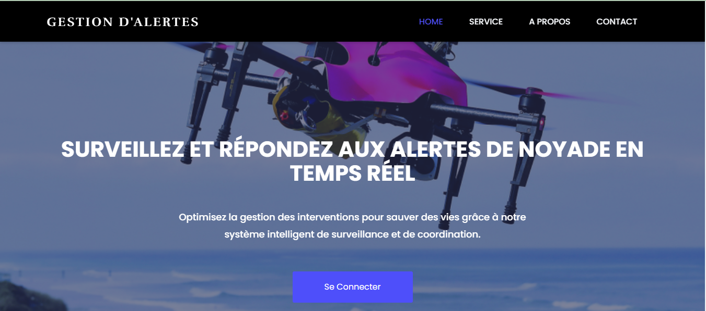
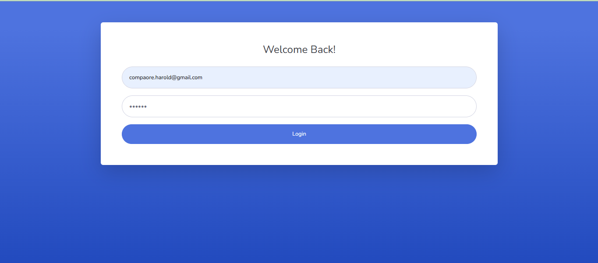
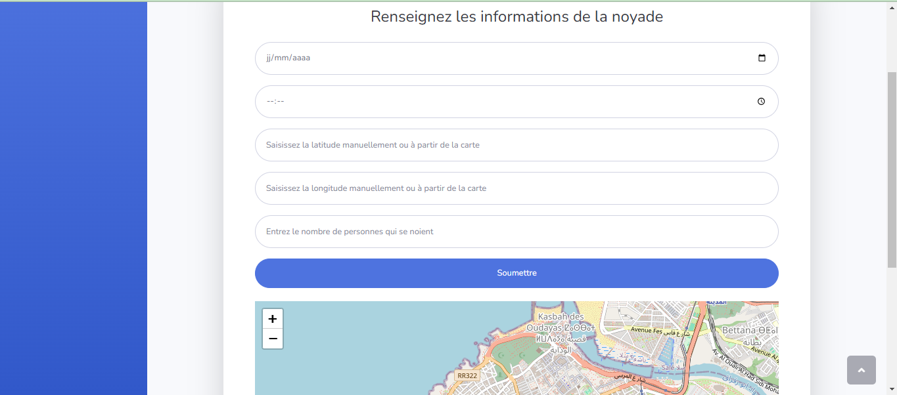
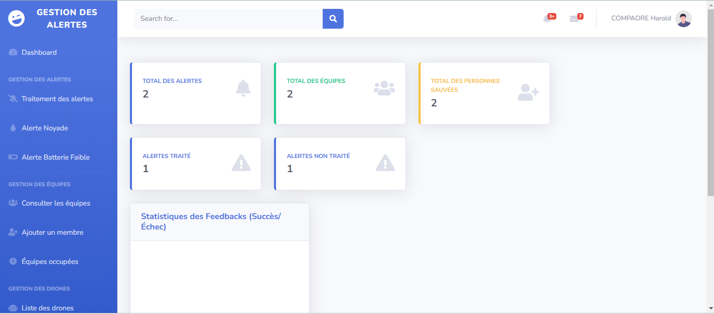
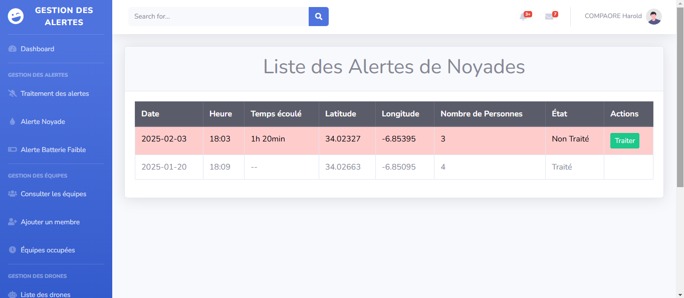
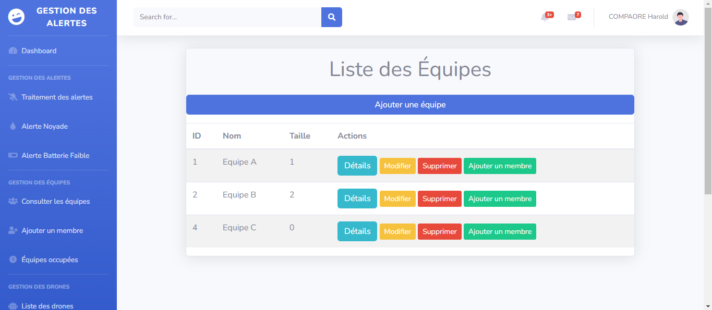

# Application-web-de-gestion-des-alertes-noyades
Ce projet, réalisé dans le cadre d’un projet fédérateur, a pour objectif
de développer une application de gestion des alertes de noyades sur les
plages. Cette application permet de traiter les alertes de noyade reçues par
des drônes de surveillance ou par des maitres-nageurs, et de les transmettre
aux équipes de sauvetage pour une intervention rapide.

## Quelques Interfaces:

### Page d'accueil

### Authentification

### Déclaration d'alertes

### Dashboard Administrateur

### Liste Alertes

### Liste Equipes

## Problématique et solution proposée
Chaque année, les plages connaissent un afflux important de visiteurs,
ce qui augmente considérablement le risque d’incidents liés à la noyade.
Les systèmes de surveillance actuels, souvent basés sur des observations
humaines ou des équipements traditionnels, présentent des limites, notamment
en termes de rapidité de détection et d’intervention. Ces retards
peuvent entraîner des conséquences graves, voire fatales.

Notre projet vient comme une solution innovante à ce problème en proposant
une application web de gestion des alertes de noyade sur les plages.
Cette application permettra d’automatiser et de centraliser la gestion des
alertes. Le concept repose sur l’intégration future de drones de surveillance
capables de détecter des incidents et de transmettre des alertes. Cependant,
dans le cadre de ce projet, nous nous limitons à un scénario où les maîtres-nageurs envoient directement les alertes via l’application.

En développant cette solution, nous visons à réduire les délais d’intervention,
à améliorer la coordination des secours et, in fine, à sauver des
vies tout en renforçant la sécurité sur les plages.

## Technologies utilisées

* **Java Entreprise Edition (JEE)**: est une plateforme de programmation
pour le développement et l’exécution d’applications d’entreprise
basées sur Java. Elle fournit un ensemble d’API et de services qui facilitent
la création d’applications robustes, évolutives et sécurisées.
* **HTML**: est le langage standard utilisé pour créer la structure des pages web. Il permet de définir les éléments de
contenu tels que les titres, les paragraphes, les liens, les images, et les
formulaires.
* **CSS(Cascading Style Sheets)**: est utilisé pour styliser les pages web crées avec HTML. Il permet de définir l’apparence visuelle des éléments,
comme les couleurs, les polices, les marges, et les dispositions.
* **JavaScript** est un langage de programmation utilisé pour ajouter des
fonctionnalités interactives aux pages web. Il permet de manipuler le DOM
(Document Object Model), de gérer les événements utilisateur, et de communiquer
avec le serveur via AJAX.
* **pMyAdmin** est un outil de gestion de bases de données MySQL via une interface web. Il permet d’éxecuter des requêtes SQL, de gérer les bases de
données, les tables, les colonnes, les relations, les index, les utilisateurs,
et les permissions.
* **Apache HTTP Server**, connu pour sa robustesse, sa flexibilité
et sa capacité à gérer un grand nombre de requêtes simultanées, Apache est un serveur
web open-source très populaire. Il est utilisé pour servir des pages
web aux utilisateurs.
* **Eclipse** est un environnement de développement intégré (IDE) utilisé
pour écrire, déboguer et déployer des applications Java. Il offre de nombreuses
fonctionnalités telles que l’auto-complétion de code, la gestion de
projets, et l’intégration avec des outils de versioning comme Git.
